# MediGraph Clinic System - Use Case Diagram

```mermaid
graph TD
    %% Actors
    Doctor((Doctor))
    PharmacistAdmin((Pharmacist / Admin))
    Patient((Patient))

    %% Use Cases
    UC1[Patient Management<br/>Create / Edit / Delete]
    UC2[Appointment Scheduling<br/>Book / Edit / Cancel]
    UC3[Medical Records<br/>Create / Edit / Delete]
    UC4[Medicine Inventory<br/>Add / Edit / Delete]
    UC5[Dashboard View<br/>Statistics & Graphs]
    UC6[Search Patients<br/>by Name or Phone]
    UC7[Search Doctors<br/>by Name or Specialty]
    UC8[View Medical History<br/>Patient Records]
    UC9[View Appointment List<br/>Upcoming & Past]

    %% Actor - Use Case connections
    Doctor --> UC2
    Doctor --> UC3
    Doctor --> UC5
    Doctor --> UC7
    Doctor --> UC8
    Doctor --> UC9

    PharmacistAdmin --> UC1
    PharmacistAdmin --> UC4
    PharmacistAdmin --> UC5
    PharmacistAdmin --> UC6
    PharmacistAdmin --> UC7

    Patient --> UC2
    Patient --> UC6
    Patient --> UC8
    Patient --> UC9

    %% Styling
    style Doctor fill:#0D9488,stroke:#0D9488,color:#fff
    style PharmacistAdmin fill:#7C3AED,stroke:#7C3AED,color:#fff
    style Patient fill:#EA580C,stroke:#EA580C,color:#fff
    style UC1 fill:#F0FDF4,stroke:#0D9488
    style UC2 fill:#F0FDF4,stroke:#0D9488
    style UC3 fill:#EFF6FF,stroke:#0369A1
    style UC4 fill:#F0FDF4,stroke:#0D9488
    style UC5 fill:#FEF3C7,stroke:#D97706
    style UC6 fill:#F1F5F9,stroke:#64748B
    style UC7 fill:#F1F5F9,stroke:#64748B
    style UC8 fill:#EFF6FF,stroke:#0369A1
    style UC9 fill:#F0FDF4,stroke:#0D9488
```

## Actor Descriptions

| Actor | Description |
|-------|-------------|
| **Doctor** | Medical staff who diagnose patients, create medical records, and manage appointments |
| **Pharmacist / Admin** | Clinic staff who manage patient data, medicine inventory, and view reports |
| **Patient** | Individuals who book appointments, view their medical history and appointments |

## Use Case Descriptions

| Use Case | Actor(s) | Description |
|----------|-----------|-------------|
| Patient Management (CRUD) | Pharmacist/Admin | Create, read, update, and delete patient information |
| Appointment Scheduling | Doctor, Patient | Book new appointments, edit or cancel existing ones |
| Medical Records (CRUD) | Doctor | Create, read, update, and delete patient medical records with Diagnosis and Treatment |
| Medicine Inventory (CRUD) | Pharmacist/Admin | Add, edit, and delete medicine data including price and stock |
| Dashboard View | Doctor, Pharmacist/Admin | View statistics: total patients, doctors, appointments, medicines, and medical records |
| Search Patients | Pharmacist/Admin, Patient | Search patients by first name, last name, or phone number |
| Search Doctors | Doctor, Pharmacist/Admin | Search doctors by name or specialty |
| View Medical History | Doctor, Patient | View patient's past medical records and treatments |
| View Appointment List | Doctor, Patient | View upcoming and past appointments |
